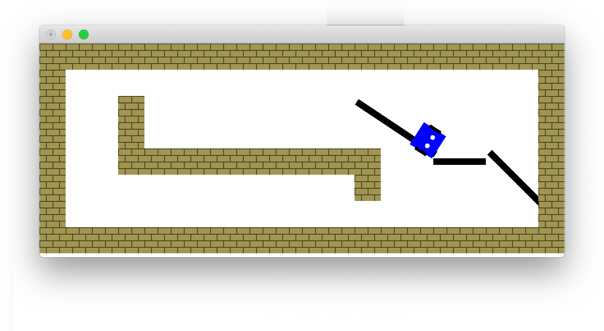
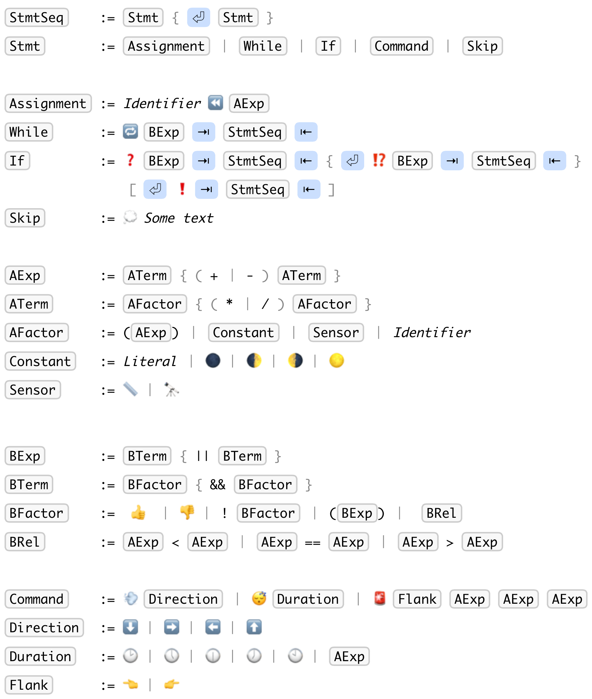

# The 🤖 Programming Language

__A simple Emoji-based programming language to control a physical or simulated [mBot](https://www.makeblock.com/mbot).__

While 🤖 was not meant to be serious, it does work. This repository provides an interpreter for the language, written in Haskell. If you have a physical mBot, you can write programs and execute them on there. If not, we provide a simulator to mimick the mBot and its surroundings.


## 📝 Example Programs

### Police Car

This program makes the robot blink its LEDs like a police car.

```
🔁👍
   🚨 👈 100 0 0
   🚨 👉 0 0 100
   😴 🕑
   🚨 👈 0 0 100
   🚨 👉 100 0 0
   😴 🕑
```

In the infinite loop, we set the left LED to red and the right LED to blue. After that, we wait 400 milliseconds, swap the colors, wait once more and start over.

### Obstacle Avoidance

This program makes the robot drive straight ahead and avoid any obstacles.

```
💭 And I would drive 500 miles..

dist ⏪ 20

🔁👍
   ❓ 📏 > dist
      💨  ⬆️
   ❗️
      💨  ⬇️
      😴  🕔
      💨  ➡️
      😴  🕑
```

Specifically, we continously read the distance sensor (📏) and compare it to the threshold `dist`. When the distance is greater than `dist`, we keep driving straight ahead. Otherwise, we back up for 800 ms and then turn right for 400 ms before we continue our way.


### Follow The Line

This program makes the robot follow a black line on the floor.

```
prev ⏪ 🌑

🔁👍
   new ⏪ 🔭

   💭 Reuse the last line reading if there's no line in sight,
   💭 or save this reading if the we know the direction of the line
   ❓new == 🌕
      new ⏪ prev
   ⁉️ new  == 🌓 || new  == 🌗
      prev ⏪ new

   ❓ new  == 🌑
      💨 ⬆️
   ⁉️ new  == 🌓
      💨 ⬅️
   ⁉️ new  == 🌗
      💨 ➡️

```

We continously read the line sensor (🔭) and steer to follow the line. If no line is detected (🌕), we reuse the last detected value. If the line is detected on the left (🌓), we steer left and if the line is detected on the right (🌗), we steer right. If the line is directly underneath us (🌑), we drive straight on.

##  Usage

To run a 🤖-program `examples/line.txt` on a physical mBot connected to your computer:

```
$ runhaskell src/nterpreter.hs examples/line.txt
```

To run a 🤖-program `examples/line.txt` on the built-in simulator:
```
$ runhaskell src/Simulator.hs examples/line.txt
```
<p align="center"></p>

## Syntax
The full syntax is described below in [Extended Backus-Naur form](https://en.wikipedia.org/wiki/Extended_Backus–Naur_form). To make this easier to read, syntax elements of the EBNF itself have a light color, while non-terminal symbols are framed and symbols denoting whitespace have a blue background.

<p align="center"></p>


## 💬 Semantics

A 🤖-program is a `StmtSeq`, i.e. a sequence of one or more statements (`Stmt`) separated by newlines. Just like in Python, blocks are expressed by their indentation. There are five types of statements:

### Assignment
The value of the arithmetic expression (`AExp`) on the right of the assignment operator (⏪) is assigned to the  _Identifier_ specified on the left hand side.

### While
This is a traditional while-loop. The body keeps being executed as long as the specified boolean expression (`BExp`) evaluates to 👍.

### If
This is a traditional if/else-if/else-statement. We first evaluate the boolean expression next to❓.

If this evaluates to 👍, we execute the corresponding body. If this evaluates to 👎, we evaluate the ⁉️-conditions one-by-one and execute the body corresponding the the first condition evaluating to 👍. If none of the boolean expressions evaluate to 👍, the body of the❗️-branch is executed, if one is specified.

### Skip
This a comment. Any text to the right of the 💭 is ignored.

### Command
This is a command for the mBot (or emulator) to execute. There are three types of command

#### Drive (💨)
Start driving in the specified direction: forwards (⬆️), backwards, (⬇️), left (⬅️) or right (➡️).

#### Sleep (😴)
Sleep for the specified duration. You can pass in an arithmetic expression denothing the number of milliseconds to sleep, or use one of the built-in constants: 400 ms (🕑), 800 ms (🕔), 1200 ms (🕧), 1600 ms (🕖) of 2 s (🕙).

#### Light
Sets the color of the specified LED to a specific color. The first argument denotes whether to set the left (👈) or right (👉) LED. The next three arguments are arithmetic expressions denoting the RGB value on a scale of 0 to 100.

### Arithmetic expressions
An arithmetic expression is an expression that evaluates to a whole number. You can use all the traditional operators (`+`, `-`, `*` and `/`) to construct new arithmetic expressions. Any decimal literal is a valid arithmetic expression. Alternatively, you can use one of the built-in constants: 🌑, 🌓, 🌗 and 🌕  to denote 0, 1, 2 and 3 respectively. (Think about the binary representation of those numbers to see why this makes sense).

Another arithmetic expression is querying one of the built-in sensors. The distance sensor (📏) returns the distance to the object in front of the mBot. The line sensor ( 🔭) returns the position of the line under the mBot. The value of this sensor is always between 0 and 3:  🌑 (line on both sides), 🌓 (line on the left), 🌗 (line on the right) or 🌕 (no line detected).

### Boolean expressions
A boolean expression is an expression that either evaluates to true (👍) or false (👎). We support OR (||) and AND (&&) to combine boolean expressions. The comparison operators (`>`, `==` and `<`) also return a boolean value. 
